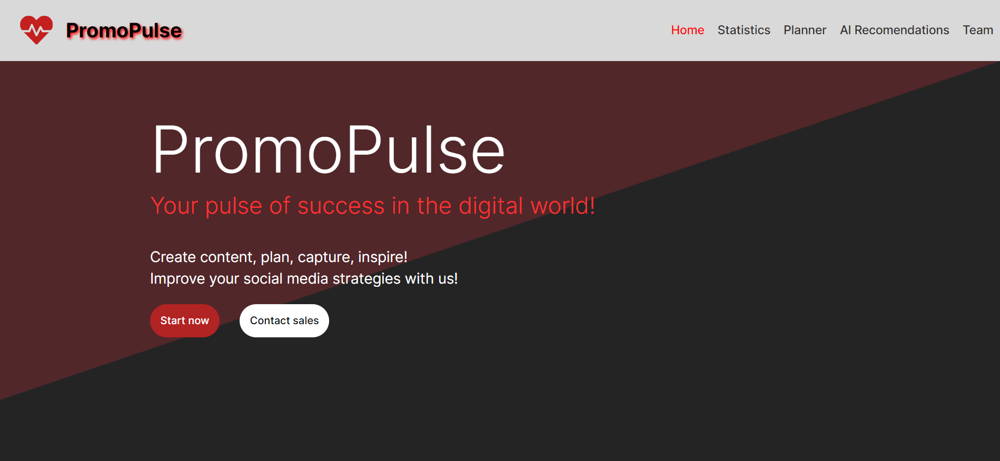
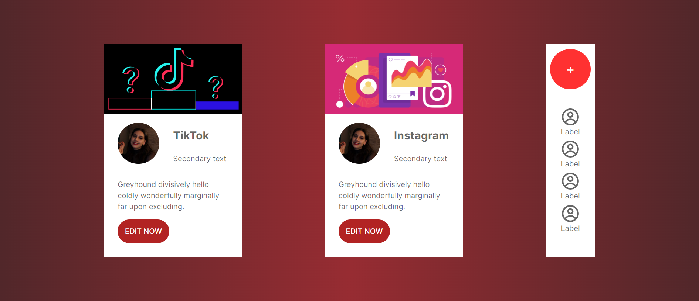
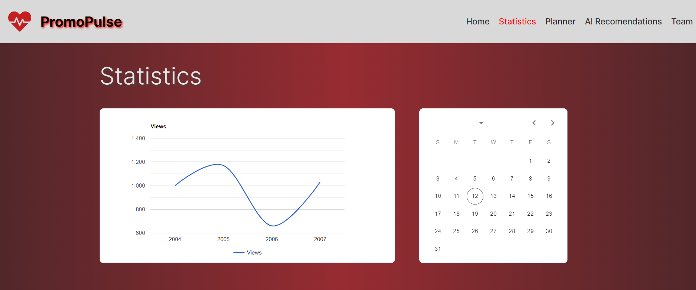
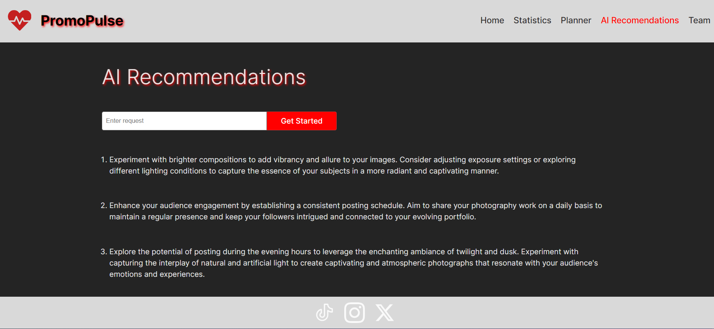

# PromoPulse
## Your pulse of success in the digital world!
### Create content, plan, capture, inspire! Improve your social media strategies with us!

Integration with platforms is a key feature of our platform, 
allowing users to unify their activity on various social media 
platforms conveniently and quickly. A fully functional **_tool for organizing advertising campaigns
for your business on all popular social media platforms_**. The platform can include a wide range of features that 
simplify management, analytics, and optimization of advertising processes.

## Analytics and Reports
The platform allows users to receive detailed information about the
effectiveness of their advertising campaigns.

## Use of AI
Consideration should be given to a possible iteration with AI services, 
as the use of Artificial Intelligence (AI) in managing social networks 
can provide automated generation of a large volume of content faster 
and more efficiently than human resources.

## Planner & Team
Ability to plan content, create a team, and manage joint projects
using a convenient planner interface.

The process of creating this project explores and considers the interaction 
with platforms and the use of AI as tools to optimize and facilitate 
advertising processes for small businesses and personal blogs, 
helping them achieve their business goals more effectively.